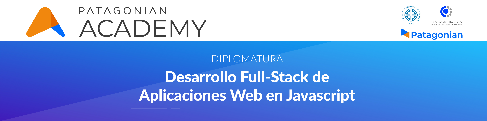

<h1 align="center">
  
</h1>


### [Facultad de Informática (UnComa)](http://faiweb.uncoma.edu.ar/) + [Patagonian Academy](https://patagonian.it/academy)


**Backend** usado en el proyecto final de la diplomatura en Desarrollo Full-Stack dictada por Patagonian Academy.


## Tabla de contenidos
- [**Introducción**](#introducción)

- [**Prerrequisitos**](#prerrequisitos)

- [**Instalación**](#instalación)

- [**Cómo funciona**](#cómo-funciona)

- [**Guía de uso**](#guía-de-uso)


## Introducción
Este proyecto se trata de un red social diseñaba para que los usuarios puedan crear sus propios memes, y además escribir comentarios sobre ellos. //TODO: expandir más y linkear al frontend

## Prerrequisitos
- [Node](https://github.com/nodejs/node) >= v12.18.2
- [npm](https://github.com/npm/cli) >= v6.14.5

## Instalación 
Se requiere el paquete npm, por lo que primero se debe ejecutar el siguiente comando:
```bash
        npm install
```
Luego para ejecutar el proyecto se puede hacer con:

```bash
        npm run start 
```
ó

```bash
        npm run watch.
```


**User Endpoint**
----
Retorna un json con los datos de un solo usuario.
* **URL**

  /users/:id

* **Method:**

  `GET`
  
*  **URL Params**

   **Required:**
 
   `id=[integer]`

* **Data Params**

  None

* **Success Response:**

  * **Code:** 200 <br />
    **Content:** `{ id : 12, name : "Cristian Vincenzini", email: "crisfullstacker@js.com" }`
 
* **Error Response:**

  * **Code:** 404 NOT FOUND <br />
    **Content:** `{ error : "User does not exist." }`

* **Sample Call:**

  ```javascript
    fetch('/users', {
        headers: {
          'Content-Type': 'application/json',
          "Accept": 'application/json',
        },
      })
  ```
  


## Rutas

UsersEndpoint:
Create a user  -  POST        /users/

Get User       -  GET         /users/id

TODO
Update user    -  PATCH    /users/me/

Delete user     -  DELETE    /users/me/
TODO


Comments Endpoint:
Create comment                      -  POST    /comments/:memeID
Get comments from Meme   -  GET      /comments/memes/:memeID
Get comments from User      -   GET     /comments/users/me


Memes Endpoint:
Create a meme               -    POST /memes/:memeID
Get all memes                 - GET  /memes
Get memes from User   - GET /memes/users/


## Diagrama de clases


